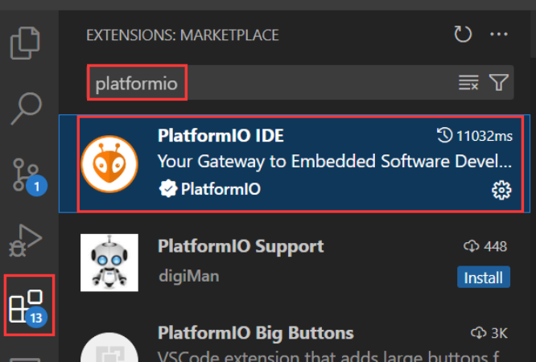

# NUCLEO-F767ZI + TMC2209 (STEP/DIR) — README

This project drives a stepper motor via a **TMC2209** step/dir driver from an **ST NUCLEO-F767ZI** board using **STM32Cube HAL** (no Zephyr).
Code is already split into clean modules under `inc/` and `src/`.

Before starting, the platformio IDE in extensions of VScode is needed:



And the whole operation environment and code compiling are based on VScode.

---

## Wiring notes

**Logic (3.3 V domain)**

| NUCLEO-F767ZI | TMC2209 pin      | Notes                                                             |
| ------------- | ---------------- | ----------------------------------------------------------------- |
| **PA8** | **STEP**   | Step input. Pulse width set by `STEP_PULSE_US` (default 2 µs). |
| **PA9** | **DIR**    | Direction. Swap in code if motor spins opposite.                  |
| **GND** | **EN/!EN** | Active-LOW enable. LOW = driver ON.                               |
| **3V3** | **VIO**    | TMC2209 logic supply (3.3 V).                                     |
| **GND** | **GND**    | Common ground with VM supply.                                     |

**Power (motor domain)**

- **VM (12–24 V)** → TMC2209 **VM**; add **≥100 µF bulk + 100 nF** decoupling near the driver.
- Keep **logic GND** and **motor GND** common.

**Optional UART (for PDN_UART single-wire configuration)**

- NUCLEO **USART3** over ST-LINK VCP: **PD8 = TX**, **PD9 = RX**.
- For single-wire PDN_UART: typically **PD8 and PD9 each through ~1 kΩ** to **PDN_UART**, and **10 kΩ pull-up to 3.3 V** on PDN_UART. (Not required by this firmware; we use pure STEP/DIR.)

**Microstepping & motor constants**

- Make the driver’s microstep hardware setting **match the firmware**:
  - In `inc/board.h`: `#define MICROSTEPS 8` (set this to 1/2/4/8/16/… to match your TMC2209 configuration).
- If your motor is **0.9°/step**, change `FULL_STEPS_PER_REV` from `200` to `400`.

**Serial console (user input)**

- The firmware uses **USART3 (PD8/PD9)** → ST-LINK **Virtual COM Port**.
- Open a serial monitor at **115200 8N1**, with **Line ending = LF or CRLF**.

---

## Project layout

```
/inc
  board.h        # Hardware config & constants (pins, microsteps, timing)
  dwt_delay.h    # DWT-based microsecond delay (inline)
  stepper.h      # STEP/DIR/EN control API
  sysclock.h     # 216 MHz HSI+PLL clock config
  uart_io.h      # USART3 init + uart_print/uart_printf/readline

/src
  main.c         # CLI loop: read angle, move once
  dwt_delay.c    # (empty on purpose; header is inline)
  stepper.c      # GPIO init + move/angle helpers
  sysclock.c     # Clock tree setup
  uart_io.c      # USART3 HAL init + I/O helpers
```

> The **CLI** accepts one angle per line (e.g. `30`, `-45`, `90.0`).
> With `ALLOW_ONLY_FOUR_ANGLES = 1` (default), only **±30, ±45, ±90, ±180** are executed; others are rejected.

---

## Build & flash (VS Code + PlatformIO)

### 1) `platformio.ini`

Minimal, **ST-LINK SWD (recommended)**:

```ini
[env:nucleo_f767zi]
platform = ststm32
board = nucleo_f767zi
framework = stm32cube
upload_protocol = stlink
debug_tool     = stlink
```

> If you previously used the drag-and-drop “mbed” method and hit MSD issues, switch to `stlink` for reliability.

**Windows driver hint (only if `stlink` fails to connect):**
Use **Zadig** to set **ST-LINK/V2-1 (Interface 0)** to **WinUSB**. Leave the **Virtual COM Port (Interface 2)** on its standard VCP driver.

### 2) Build

- In VS Code → PlatformIO: **Build**.

### 3) Flash

- **Upload** in PlatformIO.
- If you prefer ST’s official flasher, you can use **CubeProgrammer CLI**:
  ```ini
  upload_protocol = custom
  upload_command  = "C:\Program Files\STMicroelectronics\STM32Cube\STM32CubeProgrammer\bin\STM32_Programmer_CLI.exe" -c port=SWD -w "$SOURCE" -v -rst
  ```

### 4) Serial monitor

- Open the **ST-LINK VCP** COM port at **115200**, **LF/CRLF** line ending.
- On reset you should see:
  ```
  === NUCLEO-F767ZI Stepper (STEP/DIR) ===
  FULL=200, uStep=8, step_period=800us
  Mode: ONLY {±30, ±45, ±90, ±180} degrees
  Enter angle and press <Enter> ...
  >
  ```

---

## How to run the tests

This project doesn’t use a unit test framework; testing is **interactive via UART** + observation. Suggested procedures:

### A) Connectivity & CLI smoke test

1. Power the NUCLEO via ST-LINK USB; open serial monitor (**115200, LF/CRLF**).
2. Expect the banner as above.
3. Type `help` then Enter → expect a short usage line.
4. Type `0` then Enter → expect `WARN: 0 step, ignored.`

### B) Motion sanity tests (with motor mechanically free)

1. Command **`30`**, **`45`**, **`90`**, **`180`** (one per line).
   - Motor should move once per command, with a brief stop between moves.
2. Command **`-90`** → direction should reverse.
3. If angles are **too large or too small**, verify:
   - `MICROSTEPS` matches the driver’s hardware setting.
   - `FULL_STEPS_PER_REV` matches your motor (200 vs 400).

### C) Calibration quick-check

1. Command **`360`** (temporarily set `ALLOW_ONLY_FOUR_ANGLES` to `0` in `board.h` if needed).
2. The shaft should rotate **one full revolution**.
   - If it rotates ~**2×**, your `MICROSTEPS` is set **too high** in firmware (e.g., firmware=16 but driver=8).
   - If ~**0.5×**, `MICROSTEPS` is **too low** (e.g., firmware=8 but driver=16), or your motor is **400 steps/rev**.

### D) Direction test

- Send **`+90`** and **`-90`** and confirm opposite motion.
- If inverted, swap `cw ? GPIO_PIN_SET : GPIO_PIN_RESET` inside `Stepper_SetDir()`.

### E) Reliability test

- Reduce/increase speed by editing `STEP_PERIOD_US` (smaller = faster).
- Ensure no missed steps at your desired speed; if needed, slow down or add proper acceleration profiling later.

---

## Notes & troubleshooting

- **No motion after typing?**Make sure your serial **Line ending** is **LF** or **CRLF**; the CLI waits for `\n`.
- **90° moves ~180°** → `MICROSTEPS` mismatch between firmware and TMC2209 hardware.
- **Upload errors with `stlink`:** close CubeIDE/Programmer; ensure ST-LINK “Debug (Interface 0)” is WinUSB; try another cable/port.
- **Drag-and-drop (mbed) shows “No space left” or `FAIL.TXT`:** power-cycle USB; delete files (do **not** format); update ST-LINK firmware; or use `stlink`/CubeProgrammer instead.

---

## License

Use, modify, and integrate freely within your project. Attribution appreciated.
